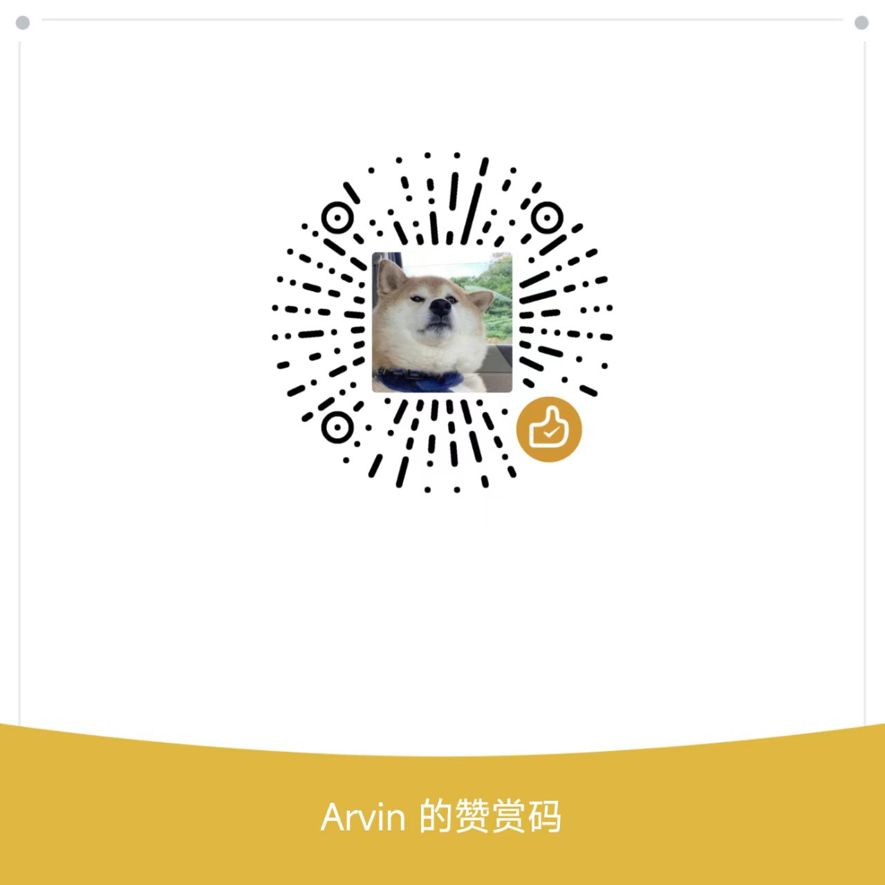

# 卡片管家 CardManager

卡片管家是一款本地优先的银行卡、账户、日历任务和小金库管理工具。它适合同时管理实体卡、虚拟卡、多币种账户、还款提醒、保活任务、定投和存款计划。

数据默认保存在本机，不做云同步，不上传个人信息。

当前版本：**2.2.1**

## 功能亮点

- 卡片管理：记录银行、卡种、卡组织、币种、有效期、状态、备注、卡面图片和银行 Logo。
- 分组浏览：支持卡片分组、折叠、排序、搜索、筛选、图册模式和列表模式。
- 日历任务：支持每月、每周、每季度、每 N 天、单次任务，并可关联卡片。
- 小金库：记录快速流水和投资项目，支持定投、存款、底仓、资金调整、归档冻结。
- 多币种：小金库支持 CNY / HKD / USD 切换和汇率折算。
- 非交易日：投资任务可自动判断非交易日，并支持顺延到下一个交易日。
- 数据统计：支持卡片状态、卡组织、币种、分组、任务频率、小金库等本地统计。
- 备份恢复：使用 `.cmbak` 导入导出备份，覆盖卡片、任务、小金库、设置和图片资源。
- 个性化：支持深色模式、自定义字体、卡面布局、底部 Tab 和数据页显示项调整。

## 2.2.1 更新

- 覆盖导入会先完整解析并验证备份，再在单个 Room 事务中替换数据，降低损坏备份影响现有数据的风险。
- 备份 JSON 使用系统 JSON 转义规则，避免备注等文本中的控制字符损坏备份。
- 新导出的 `.cmbak` 必须设置密码；旧版无密码备份保持导入兼容。
- 未来日期的初始资金和资金调整只在生效日期到达后计入投资项目余额。
- 小组件在任务、快速记录、投资项目和显示币种变化后主动刷新，并共用最近一次成功汇率缓存。
- 删除卡片或分组时，投资项目会保留并解除关联。

## 下载

请到 [Releases](https://github.com/ayyy7128/CardManager/releases) 下载最新 APK。

更新前建议先在应用设置中导出 `.cmbak` 备份。

## 隐私说明

卡片管家以本地存储为主，不提供云同步服务。你录入的卡片、任务、图片和备份数据默认只保存在自己的设备或你主动导出的备份文件中。

应用可能在以下场景访问网络：

- 获取节假日/非交易日数据。
- 获取汇率数据。
- 用户主动访问 GitHub、下载页面或其他外部链接。

## 支持开发

如果这个项目刚好帮到你，可以在应用内“设置 - 关于”里找到赞赏入口，也可以使用下面的赞赏码支持后续维护。

<p>
  
  
</p>

USDT TRC-20：

```text
TBzhjqcTLQVkKiyGY3bE94RQnoj6TAFndw
```

## 开源许可

本项目基于 [Apache License 2.0](LICENSE) 开源。
